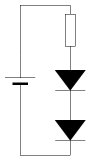

# Lecture L25-04

## Definition of Resistance

In Lecture [L25-02](https://github.com/RivenHexagon/ElectronicsTutorial/blob/main/L25-02.md), we talked about different forms of **energy**.

For each type, we had two key equations:
- One to calculate the **quantity**, or amount, of energy.
- One to calculate the **power**.

In all cases, one factor stood out — because it appeared in **both** equations.

I previously called it the *driver*. It’s the thing that gives the "push" in order to make energy flow between two elements. It is always characterized by two variables, of which the product is **power**.

In physics and engineering, especially in network theory, thermodynamics, and system modeling, these variables are called **Effort** and
**Flow**.

Typically:
- **Energy** is **Effort × Flow**, integrated **over time** (E = P × t).
- **Power** is **Effort × Flow**, or energy **per time** (P = E / t).

 Here’s how this idea connects across different types of energy:

| Domain                    | Effort                     | Flow                        | Power = Effort × Flow      |
|--------------------------|-----------------------------|-----------------------------|----------------------------|
| Mechanical (rotational)  | Torque (Nm)                 | Angular velocity (rad/s)    | Torque × ω                 |
| Mechanical (linear)      | Force (N)                   | Velocity (m/s)              | Force × v                  |
| **Electrical**           | **Voltage (V)**             | **Current (A)**             | **Voltage × Current**      |
| Thermal                  | Temperature difference (ΔT) | Entropy flow (dS/dt)        | ΔT × (entropy flow)        |
| Hydraulic                | Pressure (Pa)               | Volumetric flow rate (m³/s) | Pressure × Flow            |


With this understanding, we can now give a general definition of **resistance**:

> \>  
> **Resistance is the effort needed to drive a certain amount of flow.**  
> \>


---

> ### Example with Thermal Resistance
> 
> Lets take a water boiler of 80 l capacity, a storage temperature of 70°C and a styrofoam insulation.
> 
> The "driving force" or **efford variable** is the **temperature difference**:
> 
> $Delta T = 70^\circ\text{C} - 20^\circ\text{C} = 50 \text{K}$
> 
> With a given surface area and thermal conductivity of styrofoam one can [estimate](https://github.com/RivenHexagon/ElectronicsTutorial/blob/main/L25-04-aside.md) the **thermal resistance** $R_\text{th}$ of about 2.86 K/W.
> 
> The heat loss (power) through the insulation is then:
> 
> $P = \frac{\Delta T}{R_{\text{th}}}$
> 
> $P = \frac{50}{2.857} \approx 17.5\, \text{W}$
> 
> The heater loses about 17.5 Watts continuously just to maintain the 70°C water against 20°C surroundings.
> 
> To match the structure above:
> 
> * **Temperature difference** $\Delta T$ is the **effort variable**
> * **Heat loss** $P_\text{th}$ is the **flow variable**
> 
> * **Thermal resistance** $R_\text{th}$ is the "difficulty" or "obstacle" to overcome
> 
> #### Supplement: Energy lost over 24 h:
> 
> $E = P \times t$
> 
> where:
> - $P = 17.5\, \text{W}$
> - $t = 24\, \text{h} = 86400\, \text{s}$
> 
> Thus:
> 
> $E = 17.5\, \text{W} \times 86400\, \text{s} = 1,512,000\, \text{J} = 1,512\, \text{kJ}$
> 
> Convert to kilowatt-hours:
> 
> $E = \frac{1,512\, \text{kJ}}{3600\, \text{kJ/kWh}} \approx 0.42\, \text{kWh/day}$

## Electrical Resistance


A light bulb has the values 6 V and 100 mA engraved on it's socket.  
It's glowing filament imposes a resistance to the flow of electrons.  
It takes 6 V to drive a current of 100 mA through it, reaching its nominal brightness.  
Let us define:

> \>  
> **Electrical resistance is the proportionality between the effort in voltage [V] and the flow of a current [A].**  
> \>

In other words:  
➔ It’s the amount of voltage effort required to make a certain amount of current flow.

This matches the structure above, where:

* **Voltage U** in Volt [V] is the **effort** variable
* **Current I** in Ampère [A] is the **flow** variable,
* **Resistance R** in Ohm [Ω] is the "difficulty" or "obstacle" you need to overcome.

Note the equivalence: 
* Thermal resistance = Kelvin / Watt (thermal)
* Electrical resistance = Volt / Ampere  
* General resistance = Effort / Flow

This can be put in the equation, called **Ohm's Law**.

> \>  
> **Ohm's Law**: $R = \frac{U}{I}$  
> \>

## Animation and Practical Circuit
The equivalence of **water flow** and **electricity** can be demonstrated in this [circuit simulator](https://www.falstad.com/circuit/circuitjs.html) by *Falstad*
```
$ 1 0.000005 10.20027730826997 50 5 43 5e-11
r 448 80 448 224 0 330
s 176 80 448 80 0 0 false
v 176 352 176 80 0 0 40 5 0 0 0.5
w 448 352 176 352 0
162 448 224 448 352 2 default-led 1 0 0 0.01
g 176 352 176 384 0 0
o 0 64 0 4099 5 0.05 0 2 0 3
o 4 64 0 4099 2.5 0.0125 1 2 4 3
o 2 64 0 4099 5 0.0125 2 2 2 3
38 0 F1 0 1 101 -1 Resistance
```

## A few more Notes

* linearity of Resistors (R = 300)
  * 300 V ➔ 1 A
  * double voltage, double current: 600 V ➔ 2A
  * 3 V ➔ 0.01 A
* Across and through variables
* treat LED like a light bulb (or black box)
  * bulb has voltage and current engraved
  * half current with half voltage -> half brightness
* LED not linear
  * [red](https://cdn-reichelt.de/documents/datenblatt/C700/5003R1D-EHB-A.pdf) (2.2 V) vs [blue](https://cdn-reichelt.de/documents/datenblatt/C700/5034B2D-EHD-A.pdf) (3.3 V)
  * half current -> half brightness
  * but not half voltage
  * almost same forward voltage for 10 mA or 20 mA
  * calculate example

### Example with red LED

* U<sub>s</sub> = 9 V
* U<sub>f</sub> = 2.0 - 2.2 V
* I = 10 - 20 mA

With 10 mA (half brightnes):<br>

$R_1 = \frac{U_s-U_f}{I_1} = \frac{(9\,V - 2.0\,V)}{0.01\,A} = 700\,Ω\,➔\,680\,Ω$

With 20 mA (full brightnes):<br>

$R_\text{2a} = \frac{U_s-U_f}{I_1} = \frac{(9\,V - 2.2\,V)}{0.02\,A} = 340\,Ω\,➔\,330\,Ω$

$R_\text{2b} = \frac{U_s-U_f}{I_1} ≈ \frac{(9\,V - 2.0\,V)}{0.02\,A} = 350\,Ω\,➔\,330\,Ω$

### Example with two LEDs




* Given: $U_\text{LED1} = 2.5 V, U_\text{LED2} = 2.5 V, U_s = 6 V$
* Wanted: I = 10 mA
* Needed: R = ?

$R = \frac{U_R}{I} = \frac{U_s - U_LED1 - U_LED2}{I} = \frac{6V - 2.5 V - 2.5V}{0.01 A} = \frac{1 V}{0.01 A} = 100\,Ω$

$I = \frac{U}{R} = \frac{0.6 V}{100\,Ω} = 0.006\,A = 6\,mA$

[Widerstandsreihe](https://www.elektronik-kompendium.de/sites/bau/1109071.htm)

TODO:
* spezifischer elektrischer widerstand und spezifischer thermischer Widerstand vergleich aside

https://www.tinkercad.com/things/6VtffgNx9Eg/editel
