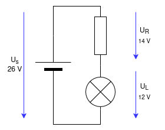

# Lecture L25-05

### Example with LED in reverse


* Given: $U_\text{rev} = 5.0 V, U_s = 6 V, R = 1\,kΩ$

https://www.tinkercad.com/things/6VtffgNx9Eg/editel

### Example with Lightbulb (12 V)



$R_\text{2b} = \frac{U_s-U_L}{I_1} ≈ \frac{(26\,V - 12\,V)}{0.02\,A} = \frac{14 V}{0.02 A} = 700\,Ω\,➔\,680\,Ω$

$P = V * I = 14 V * 0.02 A = 280 mW = 0.280 W$

(250 mW max) -> 4W resistor

```
$ 1 0.000005 10.20027730826997 43 5 43 5e-11
r 448 80 448 208 0 330
s 176 80 448 80 0 0 false
v 176 352 176 80 0 0 40 24 0 0 0.5
g 176 352 176 384 0 0
s 176 352 448 352 0 0 false
181 448 208 448 352 0 300.7126815883723 3 3 0.4 0.4
w 448 80 528 80 0
w 448 352 528 352 0
181 528 208 528 352 0 300.7126815883719 3 3 0.4 0.4
r 528 80 528 208 0 330
o 0 64 0 4099 40 0.1 0 2 0 3
o 2 64 0 4099 40 0.2 1 2 2 3
38 0 F1 0 1 101 -1 Resistance
```