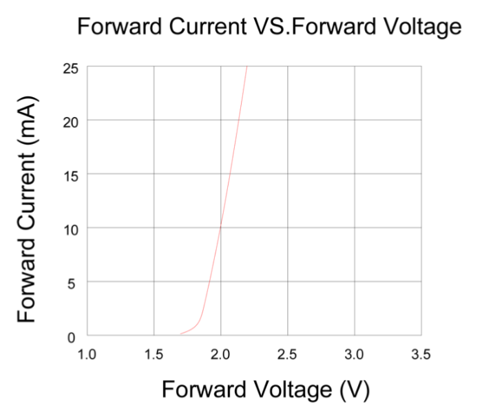

# Lecture L25-06
## Recap
The LED operates over a wide current range (5 mA to 20 mA) with minimal variation in its operating voltage:

* $U_s = U_\text{LED} + U_R$
* $\rightarrow U_R = U_s - U_\text{LED} = 9\,V - 2\,V = 7\,V$
* $9\,V = 2\,V + 7\,V$
* $U_R = R * I$
  * $U_R = 1400\,\Omega * 5\,mA = 7\,V\,(7.1\,V + 1.9\,V = 9\,V)$
  * $U_R = 700\,\Omega * 10\,mA = 7\,V\,(7.0\,V + 2.0\,V = 9\,V)$
  * $U_R = 470\,\Omega * 15\,mA = 7\,V\,(6.9\,V + 2.1\,V = 9\,V)$

## Today
* What is better
  * One resistor for two LEDs
  * One resistor for each LED
  * Parallel and serial circuit for current and voltage

* Given a toaster ratet for 115 V and 800 W
  * calculate its resistance (use P = U*I and R = U/I)
  * can I use a series resistor to use it on 230 V
  * -> two toasters in a row

* Can I use a series resistor to make an electonic device work on a higher voltage than it's rated for?