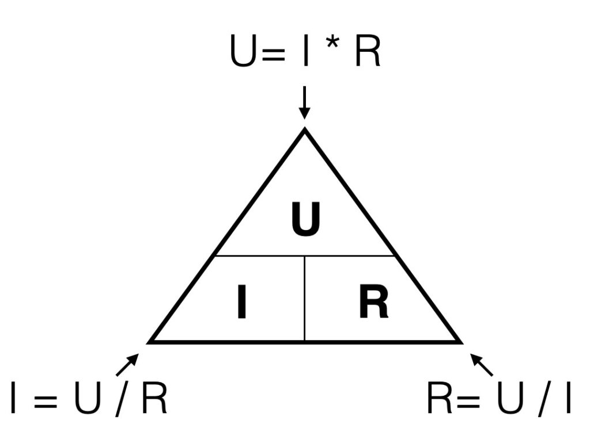
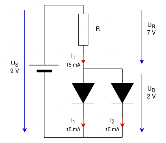

# Lecture L25-06
## Recap
### Current limiting of a LED
The LED operates over a wide current range (5 mA to 20 mA) with minimal variation in its operating voltage:

* $U_s = U_\text{LED} + U_R$
* $\rightarrow U_R = U_s - U_\text{LED} = 9\text{ }V - 2\text{ }V = 7\text{ }V$
* $9\text{ }V = 2\text{ }V + 7\text{ }V$

 
Source https://electronics.koncon.nl/ohmslaw/

* $U_R = R * I$
  * $U_R = 1400\text{ }\Omega * 5\text{ }mA = 7\text{ }V\text{ }(7.1\text{ }V + 1.9\text{ }V = 9\text{ }V)$
  * $U_R = 700\text{ }\Omega * 10\text{ }mA = 7\text{ }V\text{ }(7.0\text{ }V + 2.0\text{ }V = 9\text{ }V)$
  * $U_R = 470\text{ }\Omega * 15\text{ }mA = 7\text{ }V\text{ }(6.9\text{ }V + 2.1\text{ }V = 9\text{ }V)$

In reality, the voltage drop across the LED changes with the current, but not significant.

### Current limiting of a light bulb
The light bulb operates at $U_l = 12\text{ }V$ and $I_l = 20\text{ }mA$. Our source voltage is $U_s = 26\text{ }V$.
* $U_R = U_s - U_l = 26\text{ }V - 12\text{ }V = 14\text{ }V$
* $R_l = \frac{U_R}{I_l} = \frac{14\text{ }V}{0.02\text{ }A} = 700\text{ }\Omega$
* $R_l = \frac{U_R}{I_l} = \frac{20\text{ }V}{20\text{ }mA} = 1000\text{ }\Omega$

## Today
* Lightbulb at 24 V, and 12 mA = 0.012 A, Source is 30 V
  * calculate the current limiting resistor
    * U_R = U_s - U_l = 30V - 24 V = 6 V
    * R = U_R / I = 6 V / 12 mA = 500 Ohm
  * calculate the power loss across the resistor
    * P = U_R * I = 6 V * 0.012 A = 0.072 = 72 mW

* Lightbulb 24 V, 0.5 W
  * P = U * I -> I = P_l / U_l = 0.5 W / 24 V = 20.8 mA
  * R_l = 288 Ohm
* Calculate $R_l$ for half the light bulb current

more:

* What is better
  * One resistor for two LEDs
  * One resistor for each LED
  * Parallel and serial circuit for current and voltage

Calculate R for the circuit below:
R = U_R / I_total = 7 V / 30 mA = 230 Ohms -> 220 Ohm

One LED remaining:
U_R is still 7 V, the resistor ist still 220 Ohm
I = 7V/220 Ohm = 32 mA

* 1/2 = 0.5
* 1/3 - 0.333
* 1/4 = 0.25
* 1/5 = 0.2
* 1/8 = 0.125
* 1/9 = 0.1111

* Given a toaster ratet for 115 V and 800 W
  * calculate its resistance (use P = U*I and R = U/I)
  * can I use a series resistor to use it on 230 V
  * -> two toasters in a row

* Can I use a series resistor to make an electonic device work on a higher voltage than it's rated for?

Lightbulb 12 V, 20mA R_l = 12 V / 0.02 