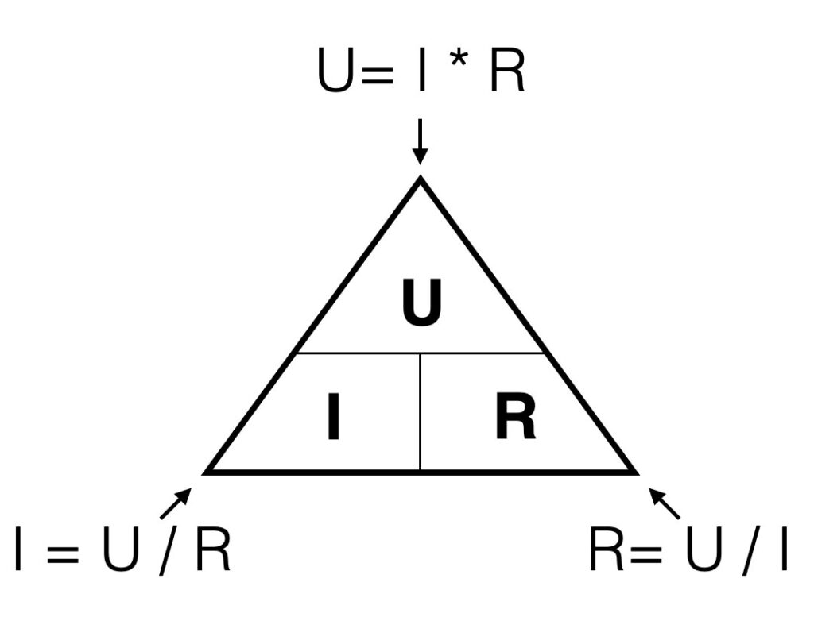

# Lecture L25-08

## Our Tool Box
### Kirchhoff Voltage Law (KVL)
* In a **serial** circuit, the **sum** of all voltage **drops** are **equivalent** to the **source** voltage.

### Kirchhoff Current Law (KCL)
* The **sum** of all **currents** flowing **into** an electrical **node** is equal to the **sum** of all currents flowing **out** of the node.

### **Serial** and **parallel** circuits
* For circuit elements connected in **series**, the **current** is the **same** through all elements.  
* For circuit elements connected in **parallel**, the **voltage** is the **same** across all elements.
* Add or refer to image with a mixed circuit

### Power
* Power is **Energy [J]** (Jules) per **Time [s]** (Seconds)
* Power = Effort * Flow
  * **Effort** Valiable = **Across** Variable
  * **Flow** Variable = **Through** Variable
* Power = **Voltage** * **Current**, $P = U \cdot I$

### Ohm's Law
* **Resistance** is the **Efford** needed per **Flow**
* Electrical **Resistance** is **Voltage** / **Current**
* For e.g. a resistor of $R = 200\text{ }\Omega$ needs a voltage $U_R = 200\text{ }V$ accross it to carry a current of $I_R = 1\text{ }A$
* <br>
    <sub>Source https://electronics.koncon.nl/ohmslaw/</sub>

## Today's Task
### One resistor and two light bulbs
* Given Parameters
  * Source voltage $U_S = 26\text{ }V $
  * Light Bulb
    * Operating Voltage $U_B = 12\text{ }V$
    * Power Consumption $P_B = 240\text{ }mW = 0.240\text{ }W$
* Wanted Parameters
  * Resistor $R =\text{ }?$


#### Solution
**Step 1:**<br>
Find the **current** draw of **one** light bulb at nominal parameters:<br>
```math
P = U \cdot I \rightarrow I = \frac{P_B}{U_B}
```
```math
I = \frac{0.240\text{ }W}{12\text{ }V} = 0.020\text{ }A = 20\text{ }mA
```

**Step 2:**<br>
Find the **total** current through the **resistor**:<br>
<br>
According to the circuit **diagram**, the resistor is connected to two light **bulbs**. Then *Kirchhoff's Current Law (KCL)* applies to the **node** that connects all three elements:
```math
I_R = I_b + I_b = 2 \cdot I_b = 2 \cdot 20\text{ }mA = 40\text{ }mA
```

**Step 3:**<br>
Calculate the **voltage drop** across the resistor:<br>
Multiple tools are at play simultaneously, but let's take it step by step. The light **bulbs** are connected in **parallel**, so they each experience the **same** **voltage** drop. We ought to choose the resistor such that the voltage drop matches the operating voltage of $12\text{ }V$. Now, we can apply *Kirchhoff's Voltage Law (KVL)* and state:

```math
U_S = U_R + U_B \rightarrow U_R = U_S - U_B
```
```math
U_R = 26\text{ }V - 12\text{ }V = 14\text{ }V
```
**Step 4:**<br>
Finally we apply *Ohm's Law* to calculate the **resistor**:
```math
R = \frac{U_R}{I_R} = \frac{14\text{ }V}{0.040\text{ }A} = 350\text{ }\Omega
```

## Today's Lesson
### Defecting Light Bulb
What happens if one light bulb defects?<br>
* Lumped elements: **total** resistance of **serial** resistors


```math
R_B = \frac{U_B}{I_B} = \frac{12\text{ }V}{0.020\text{ }A} = 600\text{ } \Omega
```
```math
R_\text{tot} = R + R_B = 350\text{ }\Omega + 600\text{ }\Omega = 950\text{ }\Omega.
```
```math
I = \frac{U_S}{R_\text{tot}} = \frac{26\text{ }V}{950\text{ }\Omega} \approx 27\text{ }mA
```
```math
U_B = R_B \cdot I_\text{tot} = 600\text{ }\Omega \cdot 27\text{ }mA \approx 16.2\text{ }V
```
```math
P_B = U_B \cdot I_\text{tot} = 437\text{ }mW
```
```math
P = I \cdot U = I \cdot (U) = I \cdot (I \cdot R) = I^2 \cdot R 
```

```math
P = I \cdot U = (I) \cdot U = U/R * U = U^2 / R
```

### Parallel Resistors
We now know the **resistance** of the **bulb**. Let us double-check the current draw of *Task 1* by an alternative approach. We evaluated the current draw of a single bulb in **Series** with the **resistor** by simply **summing up** the resistances resulting in the **total** resistance. Then we applied the **source** voltage to that *lumped* circuit - the single remaining *total* resistor of 950 Ohms. We gained abaout 27 mA.


We now know the **resistance** of the **bulb**. Let's verify the current drawn in *Task 1* using an alternative approach. We determined the current through a single bulb in **series** with the resistor by simply **adding** their **resistances**. We obtained the **total** resistance $R_\text{tot} = 950\text{ }\Omega$. We then applied the source voltage to this *lumped* or **equivalent** circuit - the single resistor $R_\text{tot}$. This yielded a current of approximately 27 mA.

We can consider the two lamps as two **parallel** resistors and calculate the **total** parallel resistance. If two ***identical*** resistors are in parallel, the total resistance is just ***half*** the resistance of a **single** one.

In case of two different parallel resistors $R_1$ and $R_2$, we can calculate the total resistance as follows:
```math
R_\text{||} = \frac{R_1 \cdot R_2}{R_1 + R_2}
```


## Circuit Simulation 
Find the *Falstad* circuit simulatior [here](https://www.falstad.com/circuit/circuitjs.html). It uses a realistic model of the light bulbs. The bulbs have a warm up time of 400 ms. Let the simulation time pass at least 400 ms to see the full effect of changes to the circuit.

**Import** our circuit by importing **text block** below with *File -> Import From Text* in the simulator applets **menu**
```
$ 1 0.000005 18.278915558614752 48 5 43 5e-11
v 96 272 96 48 0 0 40 26 0 0 0.5
w 96 48 192 48 0
r 192 48 192 160 0 350
181 192 160 192 272 0 480.70914826594577 0.24 12 0.4 0.4
181 320 160 320 272 0 480.70914826594577 0.24 12 0.4 0.4
w 320 160 192 160 0
w 320 272 192 272 0
w 96 272 192 272 0
g 96 272 96 288 0 0
```

## Further Lectures
* AC voltage and current
* Build a project

