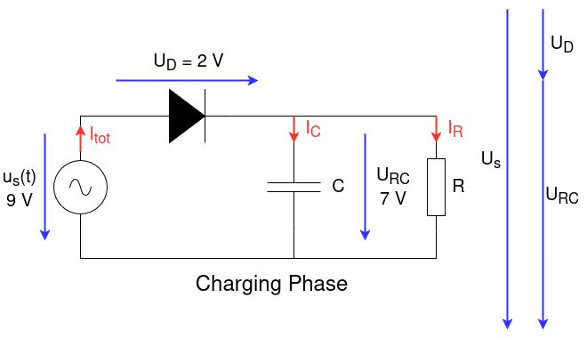
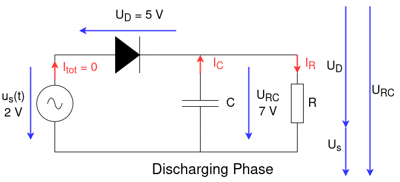
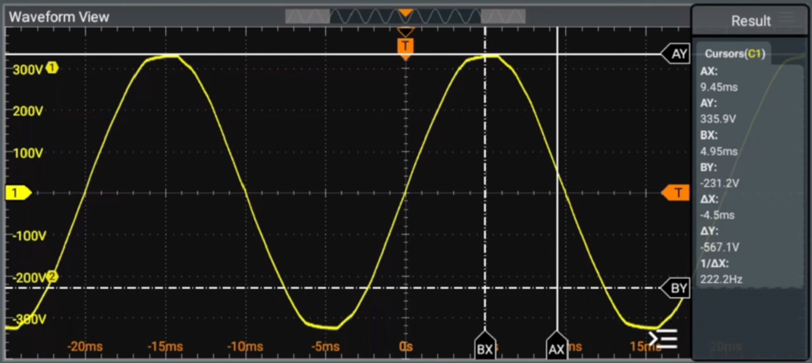
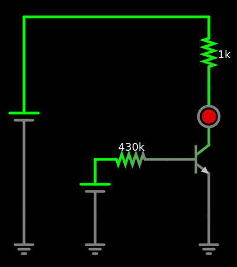

# Lecture L25-10



text
## Recap
### AC Voltage


An AC voltage is a constantly changing voltage that **oscillates** between a positiv and negative **maximum** voltage $\hat{U}$ (pronounced *U hat*). But if we talk about an AC voltage of $U$, the **nominal** voltage $U$ does **not** indicate the **maximum** $\hat{U}$. The true relation is 

```math
\hat{U} = U \cdot \sqrt{2}
```

So that for e.g. $U = 230\text{ }V$ truely oscillates between $\hat{U} =  230\text{ }V\cdot \sqrt{2} = 325\text{ }V$. And that is exactly the case for every electrical outlet in Europe. The voltage oscillates with a *frequency* of $f = 50\text{ }Hz$. That means we have 50 maxima, 50 minima and 100 *zero crossings* per **second**.

The factor $\sqrt{2}$ stems from the **sinusodial** time depending wave form of the voltages in our power grid. This is due to the **rotaing** electrical generators in our power plants.

```math
u(t) = \hat{U} \cdot \sin(\omega t) = \hat{U} \cdot \sin(2 \pi f\cdot t)
```

But why doesn't the nominal AC voltage indicate the maximum voltage? If we connect a resistor to a DC voltage source, the source voltage causes a current flow through the resistor and that current causes a voltage drop across the resistor. There, electrical energy is converted into heat and dissipated as $P = U_{R}\cdot I_{R}$.

* AC on resistor leads to pulsating power.
* Temperature of resistor appears to be constant
* same in a DC circuit
* AC niminal voltage creates equivalent DC power to average AC power

## Driving LED
* $I_{\text{max}} = 10\text{ }mA$

```math
R_{\text{LED}} = \frac{U}{I_{\text{max}}} = \frac{9\text{ }V}{10\text{ }mA} = 900\text{ }\Omega \rightarrow 1\text{ }k\Omega
```

* I_LED = I_B * B
* I_B = I_LED / B = 5 mA / 500 = 10 uA 
* R_B = (U_SB - U_B) / I_B = (5 V - 0.7 V) / 10 uA = 470 k



```
$ 1 0.000005 10.20027730826997 50 5 43 5e-11
t 160 224 208 224 0 1 -1.5711478260351517 0.6375646059181389 500 default
r 160 224 80 224 0 430000
162 208 144 208 208 2 default-led 1 0 0 0.01
w 208 240 208 288 0
g 208 288 208 320 0 0
v 80 288 80 224 0 0 40 5 0 0 0.5
g 80 288 80 320 0 0
v 0 288 0 64 0 0 40 9 0 0 0.5
g 0 288 0 320 0 0
w 0 64 208 64 0
r 208 64 208 144 0 1000
```