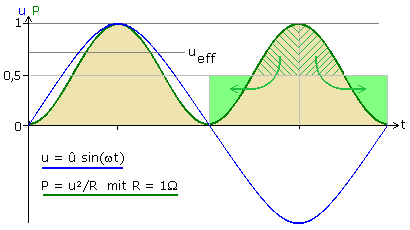

# Lecture L25-10


text
## Recap


### AC Voltage
An AC voltage is a constantly changing voltage that **oscillates** between a positive and a negative **maximum** voltage $\hat{U}$. But if we talk for e.g. about an AC voltage of $U = 230\text{ }V$, the **nominal** voltage $U$ does **not** indicate the **maximum** $\hat{U}$. The true relation is 

```math
\hat{U} = U \cdot \sqrt{2}
```

so that a $220\text{ }V$ truely oscillates between $\hat{U} =  230\text{ }V\cdot \sqrt{2} = 325\text{ }V.$

```math
u(t) = \hat{U} \cdot \sin(\omega t)
```

Let <s>us</s> **somebody else** measure the **high voltage** of an electrical **outlet** in Central Europe with an oscilloscope. Seriously - let somebody else take the **Highway to Hell** for you:
g)

* Label $U_\text{AY} = 335\text{ }V$
* Label $U_\text{BY} = 230\text{ }V$

The picture above is a **screenshot** taken from the oscilloscope. The label ***BY*** simply **marks** the point for the nominal **230 V** supply voltage used in common household electrical outlets. The yellow line represents how this voltage truely **changes** over **time**. It follows a **sinusoidal** waveform, oscillating between **approximately** –325 V and +325 V. This immediately rises the question why 230 V is the nominal voltage.

## Understanding the Meaning of 230 V

We want to understand why a voltage that **swings between ±325 V** is described as having a **nominal voltage of 230 V**. The answer lies in **power equivalence** — specifically, the **power dissipated in a resistor**.

### ⚡ Step 1: Instantaneous Power in a Resistor

Let a resistor **(water heater)** of $R = 26.4\text{ }\Omega$ be connected to an **AC voltage** source with a sinusoidal waveform:

```math
u(t) = \hat{U} \cdot \sin(\omega t)
```

where:

* $\hat{U}$ is the **peak voltage** (here: 325 V),
* $\omega = 2\pi f$, with $f = 50 \, \text{Hz}$

The **instantaneous power** $p(t)$ dissipated in a resistor is:

$$
p(t) = \frac{u(t)^2}{R} = \frac{\hat{U}^2}{R} \cdot \sin^2(\omega t)
$$


### 📊 Step 2: Time-Averaged (Mean) Power over One Cycle

To find the **mean (real) power** $P_{\text{avg}}$, we average $p(t)$ over a full cycle.



```math
P_{\text{avg}} = \frac{\hat{U}^2}{2R} = \frac{(325\text{ }V)^2}{2\cdot 26.4\text{ }\Omega} = 2000\text{ }W = 2\text{ }kW
```


### 🔁 Step 3: Compare with DC Power

Now suppose we applied a **DC voltage** $U_{\text{DC}}$ to the same resistor. The power would be:

```math
P_{\text{DC}} = \frac{U_{\text{DC}}^2}{R}
```

To deliver **the same average power**, we set:

```math
\frac{U_{\text{DC}}^2}{R} = \frac{\hat{U}^2}{2R}
```

```math
U_{\text{DC}}^2 = \frac{\hat{U}^2R}{2R} = \frac{\hat{U}^2}{2}
```

Solving for $U_{\text{DC}}$:

```math
U_{\text{DC}} = \frac{\hat{U}}{\sqrt{2}} = U_{\text{RMS}}
```

This **RMS voltage** is defined as the **DC-equivalent voltage** that produces the **same heating effect (power)** in a resistor.

---

### ✅ Conclusion

Even though the AC voltage swings between –325 V and +325 V, its **effective power** corresponds to a **DC voltage of 230 V**:

```math
U_{\text{RMS}} = \frac{325 \, \text{V}}{\sqrt{2}} \approx 230 \, \text{V}
```

Therefore, **230 V is the nominal voltage**, because that's what matters for **power delivery** in typical electrical devices:

```math
P_{\text{DC}} = \frac{U_{\text{DC}}^2}{R} = \frac{(230\text{ }V)^2}{26.4\text{ }\Omega} = 2000\text{ } W = 2\text{ }kW
```

## Rectifiers - from AC to DC


* Rectifier
  * single diode
  * 4d rect
  * Capacitor
