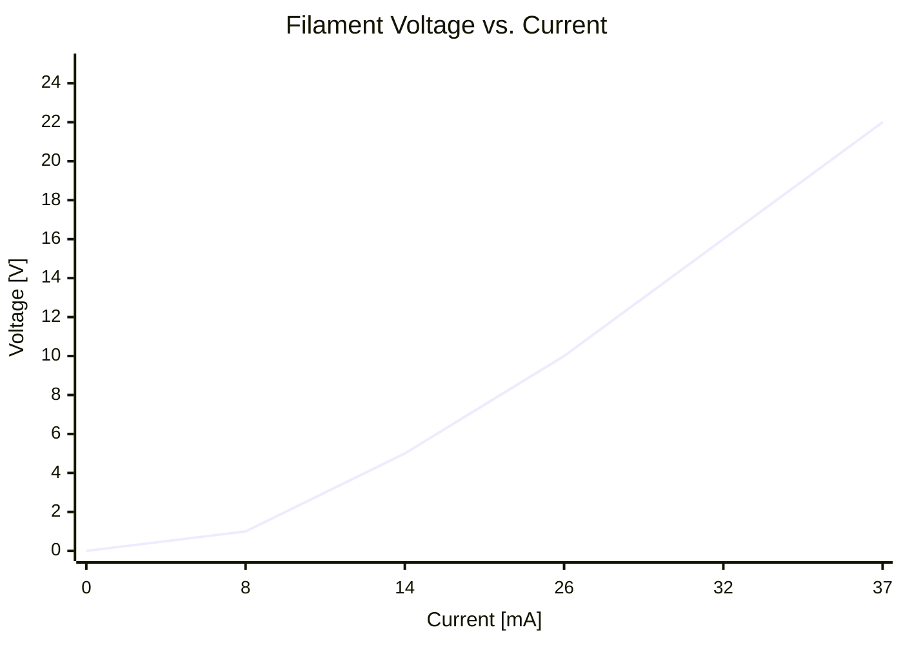
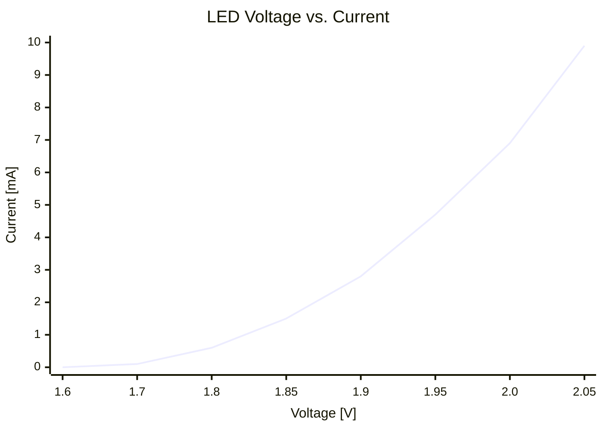

# Current and Resistance
One of the main takeaways of the previous lecture was the chain of cause and action within the circuits we've looked at. A voltage **source** causes a **current** flow through one or more load **resistors**. And the current through **any** resistor causes a **drop** in voltage across it. Further does *Kirchhoff's Voltage Law* state that the **sum** of all voltage **drops** equals the **source** voltage. But what is an electrical current and what are resistors after all?

## [A]
The flow model of a water circuit can help explaining once again. We determined the pressure created by a pump in a water circuit as a propper equivalent to a source voltage. The resulting water flow causes a drop in pressure along the pipes and across a water wheel. We identified this pressure drops as equivalent to the voltage drops across electric resistors. It is therefore obvious that the water **flow** corrensponds to the electric **current**.

Water flow is usually defined as the throughput of **volume** per unit **time**. If we choose the **count** of water **molecules** instead we get pretty close to the definition of the electric current. It is measured in ***Ampere***, named after french physicsist *André-Marie Ampère* (1775-1836). One Ampere (1A) is defined as a lot of electrons per second. Or $6.2\times10^{18} \frac{e^-}{s} = 6200000000000000000 \frac{e^-}{s}$ to be more precise.

As stated earlier, every conductive material already comes with electrons that fill the space between the atoms of the material. Copper has about $8.4\times10^{22}$ free electrons per cubic centimeter. "Free electrons" is not to be confused with such a thing as "free beer" - yet they don't cost any money *but* they are certainly not free of charge! Because in chemistry it is the charge of the outer electrons of atoms that binds them when they form molecules or the atomic lattice of metals. A copper wire, for instance, consists of copper atoms that are arranged like in a crystal.

And it is those electrons that are available for electric conductivity. In a metallic lattice they maintain only a week bond with the atoms they orbit. Once an outer electric field is applied, they come lose and jump relatively freely from one atom to the next. But it is only a small fraction of electrons that participate in an electric current. Take copper for instance. If we were able to "drain" one Ampere for one second from one cubic centimeter of copper, we still had left

$$8.4\times10^{22}e^- - 6.2\times10^{18} \frac{e^-}{s} \cdot 1s = 8.39938\times10^{22}e^-$$

Only about 0.1 permille was missing. What that would do to the copper cube and it's environment is subject to your own research. You will be surprised.

## $\Omega$
 Tungsten is a preferred material for classic light bulb filaments. Its density of free electrons is around $6.3\times10^{22}\frac{e^-}{cm^3}$. But its electrical resistance is more than three times that of copper. Light bulb fimanets usually draw just a few milliamps of current. One milliampere (mA) is $\frac{1}{1000}$ of an amp or $1\times10^{-3} A$. 
 
 Let us now go back in time for about 100 years and say a manufacturer for light bulbs is in the design process for a new bulb for a battery driven hand lamp. The brightness of the filament depends on the current that flows through it - and its diameter. Or would you expect a rod of tungsten as thick as your finger to glow with just a few milliamps of current? The manufacturer tries to make the filament as thin as possible in order to decrease the current, which in turn increases the battery life.
 
 We can define the **resistance** of the filament as the **amount** of **voltage** needed to **drive** a certain **current** that corresponds to the desired brightness. The electrical resistance is measured in Ohms and one Ohm ($1 \Omega$) is defined as one Volt per Ampere.

 [physical definition here or later?]

### Experiment #1
 Our first experiment will provide us with some real life data to work with: In this we connected a **light bulb** to a variable laboratory **power supply** unit (PSU) in **series** with an **ampere meter**. One wire connects the plus pole of the PSU with one of the current inputs of a **multi meter** (MM). These are special inputs indicated with the letters *A* and *mA*. On most MMs they are the left most inputs and are different from the right most input that measures voltages. It is indicated with the letters *V* or *mV*. The common connector of the MM (indicated *COM* and left of the voltage input) is connected with one pole of the light bulb. The other pole goes to the minus pole of the PSU. The rotary switch of the MM is set to the 200 mA range.

## Filament Resistance
<!--Electrons inside a wire are like dogs beeing dragged on a leash from tree to tree.-->

**The Cauchy-Schwarz Inequality**
$$\left( \sum_{k=1}^n a_k b_k \right)^2 \leq \left( \sum_{k=1}^n a_k^2 \right) \left( \sum_{k=1}^n b_k^2 \right)$$