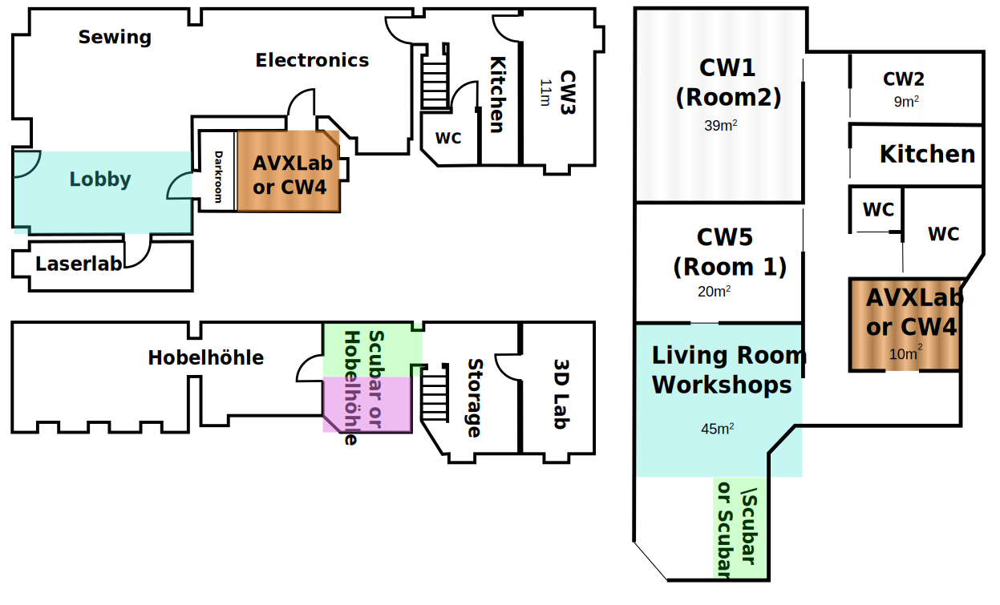

# Room Proposal G16/G13 by Riven Hexagon
## Anchor Rent as a first step
Make **finances** work **first** and **build** the future use of the rooms **around** the rental areas.

## Keep our workspaces "social" (open)
* Keep workshop **Textiles** and **Electronics** areas in the open.
* It **inspires** others and fosteres **communication**. Members work **among others** and not isolated.
* Keep a **lobby area** in the rooms of **G16** to support this.
* I'd like to introduce *Soziokratie 3.0* as a **decision** finding **tool** that leaves no one/voice behind..

## Values the needs and offers of our members
One example:
* **Tina** offers the **night shift**. 
* She prefers to have the audio equipment of the **AVX** around.
* If most **workshop areas** stay at G16, it speaks in favour of AVX at **G16**. Since she can only watch one side of the road (keep doors unlocked).

-> This conflicts with recording of sessions in the new living room. Is a compomise possible?

## Have a place for Workshops and Talks separate from the lobby
* Use the new living room for workshops and talks, so the busy areas are separated.
* Either in the new rooms of **G13** or the original rooms/areas of **G16**.

## Maps

**Grünberger 16** (left) and **Grünberger 13** (right)

## Future Vision
* Implement **Sociocraty 3.0** as a **community maintaining** and **decision making** tool
* **Expand** as our **income** allows it
